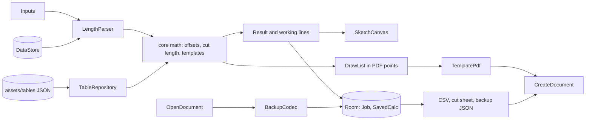

# Kickset: the fitter's calculator that shows its working

A fitter needs the multiplier to be 1.4142, not the 1.5 one paid app's reviewers caught, the cut length after both takeouts and root gaps, and a fishmouth on paper he can wrap and trace. Kickset does those jobs offline, in millimetres and fractional inches, for one price. Every answer is a dimensioned sketch with its arithmetic printed under it, every takeout comes from a bundled ASME table that names its sources, and every wrap template prints true to scale with a calibration ruler on the sheet.

## 1. Overview

- **Elevator pitch:** a one-time-purchase pipe fitting calculator: offsets with exact multipliers shown, ASME takeouts with cut length after the root gap, true-scale wrap templates as PDF with a calibration ruler, pipe data, and saved jobs exported as CSV and PDF.
- **Category:** Tools. **Launcher name:** Kickset. **Play title:** Pipe Fitter Offset Calculator.
- **Tagline:** The fitter's calculator that shows its working.
- **Play positioning line:** The one-time-price, fully offline fitter's calculator with verified math, ASME takeouts and printable wrap templates, for crews tired of subscriptions and online-only tools.
- **Price:** USD 4.99, INR 249 (the ladder's professional or privacy tool rung).

## 2. Problem and why now

A wrong travel on 6 inch Sch 80 wastes pipe, a fitting and a welder's time, so rolling offsets, takeouts and fishmouths send fitters to a phone.

**The free apps they tried.** Pipe Trades Pro Calculator (Calculated Industries) is the strongest, 50K+ and 4.8 from 1.59K reviews, but it moved from a USD 25 lifetime price to about USD 40 a year with in-app purchases up to USD 24.99, and reviewers are angry (https://play.google.com/store/apps/details?id=com.calculated.josephine). Offset Pipe calculator ranks first for "pipe offset calculator" at 100K+ but rates 3.6 from 887 reviews and shows ads (https://play.google.com/store/apps/details?id=ru.sotnikov.offsetpipe). LMF's Pipefitter Tools (100K+, 3.9) gates tools behind a USD 1.49 a month subscription, was last updated May 2023, and reviews say it needs internet every use (https://play.google.com/store/apps/details?id=com.odesk.calculator).

**Why they still pay upfront.** Pipe Fitter Calculator at USD 5.99 holds 10K+ installs and 4.4 from 223 reviews with no ads or IAP (https://play.google.com/store/apps/details?id=com.pipe.fittings.kevin ; https://www.androidrank.org/application/x/com.pipe.fittings.kevin), IT Tomizon's Pipefitter at USD 8.49 is 10K+, and the paid filter for "pipe fitter calculator" lists more than a dozen apps from USD 2.99 to 19.99 (https://play.google.com/store/search?q=pipe%20fitter%20calculator&c=apps&price=2). Yet Pipe Fitter Calculator's reviews report a 1.5 multiplier where 1.414 belongs and a broken dark mode. So a buyer pays upfront for one price, no internet dependency and math he can check.

**The honest part.** The refuter's AppBrain lookup put the category leader at roughly 36 downloads a month (not re-checkable on 2026-09-17), and 2026 paid entrants stalled: OffsetKit (USD 2.99, 0+), Pipefitter's Mate (USD 8.99, 50+). XPipe Pro (USD 8.00 on sale, 10+) already claims offline, no ads, root gap subtraction and to-scale drawings, so that pitch is not ours alone (https://play.google.com/store/apps/details?id=pro.xpipe.app). What the two store checks found in no rival as a pair is what Kickset leads with: **ASME takeout tables with cut length after root gap, and true-scale wrap templates as PDF with a calibration ruler.** The listing and first screenshot sell those two. Demand is proven by paid installs, not by search volume; sales will be a trickle, and five weeks is the ceiling.

**Why now.** Pipe Trades Pro's subscription anger is fresh, LMF's Pipefitter Tools is unmaintained, Indian paid slots run Rs 280 to 1,000.

## 3. Target audience and personas

- **Dale Hutchins, 52, journeyman steamfitter, Pasadena, Texas.** Refinery work for decades; bought Pipe Trades Pro's lifetime unlock and resents the yearly fee. Types **"pipe fitter calculator"**. Pays when screenshot two shows "true offset 20 x 1.4142 = travel 28 5/16" and the listing says one price.
- **Rakesh Nair, 34, fabrication shop supervisor, Vadodara, Gujarat.** Refinery spools in millimetres to ASME B16.9; his crew argues over a laminated takeout chart. Types **"pipe offset calculator"**. Pays when screenshot one shows a cut length with both takeouts and root gaps subtracted, at Rs 249, below OffsetKit (Rs 280) and LMF (Rs 380).
- **Ciaran Doyle, 24, apprentice pipefitter welder, Middlesbrough.** Sent to cut a 4 inch set-on branch with nobody free to show him. Types **"pipe saddle template"**. Pays when screenshot three shows the wrap sheet with its 100 mm calibration bar.

## 4. Core concept deep-dive

**How it works.** Inputs accept "12 5/16", "12-5/16", "1' 0 5/16", "313" or "12.3125"; `:core` solves in double precision and returns answers, multipliers and working lines. A Canvas sketch (proportional, not to scale) carries answers on dimension lines with the working underneath, for example `Set 300 mm x csc 45° (1.4142) = travel 424.3 mm`, and the other unit below (`16 11/16 in`).

Math, all golden-tested:
- Simple offset at angle θ: travel = set x csc θ, run = set x cot θ; presets 11.25, 22.5, 30, 45, 60 plus custom.
- Rolling offset: true offset = √(set² + roll²), then as above; inverse mode solves θ = atan(true offset / run).
- Parallel offsets: lines at spread S kicking together advance by S x tan(θ/2).
- Butt-weld cut = C-to-C minus both takeouts minus one root gap per weld. Socket-weld cut = C-to-C minus both centre-to-socket-bottom dimensions minus both engagement gaps (default 1.6 mm).
- Cut elbow takeout = A90 x tan(θ/2), plus outside, centreline and inside arc marks.
- Wrap templates at 16 or 32 stations, branch radius r, header radius R: miter y = r tan α (1 − cos φ); saddle y = R − √(R² − r² sin² φ); lateral y = (R − √(R² − r² sin² φ)) / sin β + r (1 − cos φ) / tan β. Diameter basis OD, mean or ID, default OD.

**The one memorable thing: shown working.** Every result is a sketch with its arithmetic under it. It answers the multiplier complaint and opens every screenshot.

**What it refuses to do.** No conduit bending, no bubble level, no flange torque sequences, no 3D view, no DIN/EN or threaded fittings in 1.0, no "to scale" claim without the printed bar, no network, account, ads or in-app purchase.

## 5. Complete feature set

**v1.0:**
1. **Simple offsets** with presets and custom angle; travel, run, set, csc and cot to four decimals.
2. **Rolling offsets** with true offset, travel, run and an inverse angle-from-run mode.
3. **Parallel offsets** for two to eight lines, each line's advance listed.
4. **Cut length builder:** fitting at each end (butt-weld 90 LR, 90 SR, 45 LR, tee, concentric reducer, NPS 1/2 to 24; socket-weld Class 3000 90, 45, tee, coupling, NPS 1/8 to 4), gaps editable, every subtraction listed.
5. **Cut elbow** at any angle from 90 LR or SR with arc marks.
6. **Takeout tables** for ASME B16.9 and B16.11, checked against two catalogues named on a Sources screen.
7. **Metric and fractional inch side by side**, app-wide switch, 1/16 or 1/32 inch and 1 or 0.5 mm precision.
8. **Miter wrap template**, two to five pieces or a single cut.
9. **Saddle (fishmouth) wrap template**, equal or reduced branch, plus header hole layout.
10. **Lateral wrap template**, 30 to 89 degrees, plus header hole layout.
11. **True-scale PDF** on A4 or Letter, tiled landscape with 10 mm margins and 10 mm overlap marks, 100 mm and 4 inch bars on every sheet, plus an ordinate table.
12. **Pipe data** from ASME B36.10M and B36.19M: OD, wall, ID, weight, water-filled weight, volume, schedules 10 to XXS.
13. **Flange bolt chart**, ASME B16.5 Class 150 and 300: bolt count, stud size, bolt circle, stud length. No torque values.
14. **Saved jobs** with spool labels, CSV and PDF cut sheet export, full backup and restore as one JSON file.
15. **Correct light and dark themes** plus a multipliers reference card.

**Cut, per the refuter:** conduit tab, standalone bubble level, flange torque sequences, 3D view. **Deferred:** angle readout, DIN/EN and threaded tables. Nothing was cut for offline honesty; nothing needs a network.

**v1.x:** accelerometer angle readout with hold and calibration (no permission); EN 10253 takeouts; B16.11 threaded fittings; 180 returns, caps and eccentric reducers; Hindi and Arabic strings.

**v2:** compound two-plane offsets; spool totals per size; off-centre branch templates.

## 6. Screen-by-screen UX

**Navigation.** Single activity, type-safe Navigation Compose. Compact: bottom `NavigationBar` with **Offsets, Cut length, Templates, Pipe data, Jobs**. At 600dp and wider: `NavigationRail` and two panes (inputs left, sketch right). Settings from the top bar overflow.

**Screens.**
- **Offsets:** segmented Simple, Rolling, Parallel; fields, angle chips, sketch, working, "Save to job". First launch: sheet "Work in millimetres or inches?" with the line "Results are reference values. Check before you cut."
- **Cut length:** two fitting rows opening a picker sheet, size, schedule, C-to-C with a "Use last travel" chip; cut length and the subtraction list. Inner tab "Cut elbow".
- **Templates:** segmented Miter, Saddle, Lateral; sizes, angle, pieces, stations, diameter basis; curve preview; "Export PDF", "Save to job".
- **Sheet preview:** page thumbnails with overlap marks and bars, paper chip, "Export PDF" via `CreateDocument`.
- **Pipe data:** searchable NPS list, detail with schedule chips, tab "Flange bolts".
- **Jobs:** list by last edit; detail rows reopen their calculator; "Export CSV", "Export cut sheet".
- **Save to job sheet:** recent jobs or "New job", label, "Save to job".
- **Settings:** units, precisions, gaps, paper, theme, "Back up to file", "Restore from file", Sources, Multipliers, disclaimer, privacy, licences, local counts.

**Flow 1, rolling offset to a cut.** Dale: Offsets, Rolling, set 12, roll 16, 45; reads travel 28 5/16. Cut length, "Use last travel", 90 LR and 45 LR, NPS 4, gap 1/8; reads the cut. "Save to job", Spool 14; "Saved to Spool 14."

**Flow 2, fishmouth on paper.** Ciaran: Templates, Saddle, header NPS 6, branch NPS 4. "Export PDF", A4, Downloads; "Exported 2 sheets. Print at actual size and measure the 100 mm bar." He prints, measures, wraps, traces.

**Flow 3, a shift's cut sheet.** Rakesh saves eight cuts into "Unit 3 cooling water", taps "Export cut sheet" and shares the PDF to the shop printer; the CSV goes to the planner.

## 7. Design system

**Design read:** Reading this as: a precision trade calculator for pipe fitters on site and in the shop, with a steel layout table language (layout dye, soapstone marks, dimension lines), leaning toward Archivo Narrow plus Archivo on a **layout blue and mill steel** palette.

**Dials.** Variance 3: eyes land in the same place on every calculator. Motion 2: motion only confirms actions. Density 6: inputs, sketch and working fit a 6 inch phone without scrolling.

**Palette family: layout blue and mill steel.** Layout dye on hot-rolled plate. One accent, Layout Blue, locked across every screen (HSL saturation 68 percent light, 70 percent dark).

| Token | Light | Dark | Role |
|---|---|---|---|
| Plate (background) | #EEF1F4 | #10161D | screen background |
| Sheet (surface) | #F7F9FB | #18212A | fields, sheets, sketch panel |
| Ink (onSurface) | #16202B | #E3E8ED | answers, body |
| Scale (onSurfaceVariant, outline) | #4F5B67 | #9AA6B2 | working lines, secondary text, field outlines |
| Layout Blue (primary) | #2152B0 | #86A8EA | answers on dimension lines, primary button, selection |
| On Blue (onPrimary) | #F7F9FB | #0E1A2E | text on primary |
| Rule (outlineVariant) | #C9D1D9 | #2A3540 | dividers only |
| Weld Red (error) | #A8322A | #F08A80 | invalid input |

Contrast (light, dark): Ink on Plate 14.5, 14.8; Scale on Plate 6.1, 7.3; Layout Blue on Plate 6.4, 7.6; On Blue on Layout Blue 6.9, 7.3; Weld Red on Sheet 6.3, 6.7.

**Type.** Both Google Fonts by Omnibus-Type under SIL OFL 1.1. **Archivo Narrow** SemiBold 600 for readouts: headline answer 40sp, dimension labels 18sp, screen titles 22sp. **Archivo** Regular 400 body 16sp, Medium 500 labels and working 14sp, SemiBold 600 buttons 15sp. `fontFeatureSettings = "tnum"` wherever digits stack. Fractions render as an `AnnotatedString` at 70 percent with a baseline shift, never Unicode vulgar fractions. No serif is earned. Files `archivo_regular.ttf`, `archivo_medium.ttf`, `archivo_semibold.ttf`, `archivonarrow_semibold.ttf`; licences `docs/OFL-Archivo.txt`, `docs/OFL-ArchivoNarrow.txt`.

**Radius scale.** RadiusSm 4dp (chips, fields), RadiusMd 8dp (buttons, sketch panel), RadiusLg 16dp (bottom sheet top corners). The sketch panel is the only card on a calculator screen; lists use dividers.

**Icons.** Material Symbols Outlined; fitting pickers use vector drawables stroked in Ink.

**Motion.** No first-run orchestration. A solve crossfades the answer (150 ms) and redraws the dimension line (200 ms). Everything reads `LocalReducedMotion` and snaps. One haptic on "Save to job" and on export.

**States.**
- *Calculators:* empty shows the lettered sketch and "Enter a set to solve."; no loading (solves are instant); errors inline, "Roll must be a length, like 16 or 16 3/8", or in the result area, "A lateral branch cannot be larger than the header."; success shows answers and working.
- *Sheet preview:* empty never occurs (it opens from a solved template); page-shaped skeletons past 300 ms; error "Could not write the file. Pick another folder."; success "Exported 2 sheets."
- *Pipe data:* first-open row skeletons; empty search "No size matches 7. Try 6 or 8."; a schedule a size lacks shows "NPS 1/2 has no Sch 30. Pick another schedule."; success is the filled detail.
- *Jobs and job detail:* row skeletons; empty "Save a result to start a job." with button "Open offsets"; export error "Could not write the file. Pick another folder."; success "Exported cut sheet."
- *Save to job sheet:* no jobs lists only "New job"; blank label error "Give the cut a label, like Spool 14."; success "Saved to Spool 14."
- *Settings:* no empty or loading state; restore error "That file is not a Kickset backup."; success "Backed up" and "Restored 4 jobs."

**Access.** WCAG AA as measured above, 48dp targets for gloves, content descriptions on icon buttons, text to 200 percent, sketch values exposed to TalkBack.

**Tablet and foldable.** `--orient unspecified`; state survives rotation; rail plus 40/60 panes at 600dp; checked at 841x701 and 1280x800 dp.

**Icon brief.** Ultramarine ground #4762EE to #2733BE (the registry's hue for kickset, held clear of deAIfy's azure). Mark: a near-white pipe with two 45 degree kicks forming an offset, solid square cut ends (no rings), a top highlight that reads the pipe as round.

**Screenshots (9:16).** Light 1 to 4, dark 5 and 6: cut length NPS 4 with gaps subtracted; rolling offset with working; saddle template NPS 4 on 6 with the bar; NPS 6 Sch 80 data; job "Unit 3 cooling water"; parallel offsets on a tablet.

## 8. Native architecture

**Generator flags line:**
`new-native-app.sh --dir DEVPROJECTS/kickset --name "Kickset" --pkg com.mohdshayan.kickset --perms "" --room --orient unspecified --bg "#EEF1F4" --bg-dark "#10161D"`

**Modules.** `:app` and `:core` (pure Kotlin JVM, no Android imports). Add plugin alias `kotlin-jvm = { id = "org.jetbrains.kotlin.jvm", version.ref = "kotlin" }`; `:core` applies `kotlin-jvm` and `kotlin-serialization`.

**Package map.** `core/units` (Length in mm, LengthParser, LengthFormatter); `core/offset` (Simple, Rolling, Parallel, Working); `core/fittings` (FittingTable, CutLength, CutElbow); `core/template` (Miter, Saddle, Lateral, SheetLayout, DrawList in PDF points); `core/pipe` (PipeSchedule, FlangeBolts). `:app`: `data/tables/TableRepository`, `data/db`, `data/prefs`, `data/export` (CsvExporter, CutSheetPdf, BackupCodec, TemplatePdf onto `PdfDocument`), `data/session` (last travel), `ui/<screen>` per destination, `ui/components` (SketchCanvas, WorkingLines, FractionText, FittingPicker), `ui/review`.

**ViewModels.** Offsets, CutLength, Templates, PipeData, Jobs, JobDetail, Settings; each a `StateFlow` via `stateIn(WhileSubscribed(5_000))`, solves on `Dispatchers.Default`.

**Catalog aliases.** `androidx-core-ktx`, `androidx-core-splashscreen`, `androidx-lifecycle-runtime-ktx`, `androidx-lifecycle-runtime-compose`, `androidx-lifecycle-viewmodel-compose`, `androidx-activity-compose`, `androidx-compose-bom`, `androidx-ui`, `androidx-ui-graphics`, `androidx-ui-tooling`, `androidx-ui-tooling-preview`, `androidx-material3`, `androidx-material-icons-extended`, `androidx-navigation-compose`, `androidx-room-runtime`, `androidx-room-ktx`, `androidx-room-compiler`, `androidx-datastore-preferences`, `kotlinx-coroutines-android`, `kotlinx-coroutines-test`, `kotlinx-serialization-json`, `junit`; plugins `android-application`, `kotlin-android`, `kotlin-compose`, `kotlin-serialization`, `ksp`, `kotlin-jvm`. Added library: `play-review-ktx = { group = "com.google.android.play", name = "review-ktx", version = "2.0.2" }`; if the merged manifest gains any permission from it, remove it and the prompt.

**Sensors and hardware.** None in 1.0. **Bundled assets.** `assets/tables/asme_b16_9.json`, `asme_b16_11.json`, `asme_b36_10_19.json`, `asme_b16_5_bolts.json`, together under 300 KB, each with values in mm and inches and a `sources` array (publisher, catalogue, year, page): Weldbend and Hackney Ladish catalogues for B16.9; Bonney Forge and Anvil for B16.11; Weldbend and Boltex for B16.5; Weldbend's pipe data pages plus one mill data sheet for B36.10M and B36.19M. A catalogue lacking a table is swapped for another published manufacturer catalogue and recorded. Only dimensional facts; no standard text is reproduced. `assets/privacy.html`. Four Archivo TTFs under 1 MB, SIL OFL 1.1.

**Manifest permissions: none.** No permission of any kind is declared. Export and import use `CreateDocument` and `OpenDocument`, which need none. No INTERNET: the review prompt's network work happens inside the Play Store app.

**Background work, widgets, tiles.** None; exports finish in a foreground coroutine.



## 9. Data model

**Room, version 1.**
- `Job`: `id: Long` PK autogenerate, `name: String`, `notes: String`, `createdAt: Long`, `updatedAt: Long`.
- `SavedCalc`: `id: Long` PK, `jobId: Long` FK cascade, indexed, `kind: String` (SIMPLE_OFFSET, ROLLING_OFFSET, PARALLEL_OFFSET, CUT_LENGTH, CUT_ELBOW, MITER, SADDLE, LATERAL), `label: String`, `inputsJson: String`, `headline: String`, `unitSystem: String`, `createdAt: Long`.

**DataStore keys.** `unit_system` (MM, INCH), `inch_precision` (16, 32), `mm_precision` (1.0, 0.5), `root_gap_mm` (3.0), `socket_gap_mm` (1.6), `paper_size` (A4, LETTER), `theme_mode` (SYSTEM, LIGHT, DARK), `units_chosen`, `success_count`, `review_prompted`, `usage_counts_opt_in` (false), `count_solves`, `count_saves`, `count_exports`.

**Export and import.** Backup `kickset-backup-YYYY-MM-DD.json`: `{"format":"kickset-backup","schema":1,"exportedAt":…,"prefs":{…},"jobs":[{…,"calcs":[…]}]}`; restore validates format and schema, then merges or replaces (the user picks) in one transaction. CSV per job: `job,label,kind,unit,headline,inputs`, UTF-8 with header. Cut sheet PDF: job, date, label, kind, size, cut length in both units, working lines. All through `CreateDocument` and the share sheet.

## 10. Pricing and countries

USD 4.99 and INR 249, the ladder's professional or privacy tool rung (market-map-v2), which is also the map's stated opening for trade calculators. The record's decision stage floated Rs 299 on the claim that it undercuts every Indian paid slot, but OffsetKit sits at Rs 280; Rs 249 undercuts both OffsetKit and LMF (Rs 380). Play pricing templates were removed in October 2025, so every other country is set by hand in Play Console, emerging markets at 25 to 50 percent of USD. No launch discount; a 20 percent sale in week two. Refunds: Play's 48-hour window. All countries, English UI.

Why this pays: USD 4.59 to 4.99 holds 17.5 percent of the top 40 paid apps, trade tools such as Electrician's Bible sell at USD 4.99, goal-driven buyers are less price-elastic, and the incumbents being displaced ask USD 5.99 to 19.99 or a yearly fee.

## 11. Play Store listing

**Title (29 of 30):** `Pipe Fitter Offset Calculator`

**Short description (78 of 80):** `Takeouts, wrap templates, rolling offsets. One-time, offline, no ads, no login`

**Full description (1,872 of 4,000):**

```
Cut length after the root gap from ASME takeout tables, and miter and saddle wrap templates that print true to scale.
Rolling offsets with the multiplier shown, so you can check the math: 1.4142 for a 45, not a rounded guess.
One price. No subscription, no ads, no account, and no signal needed in a plant basement.

Takeouts and cut length
Pick the fitting at each end and the size, enter center-to-center, and get the cut length with every subtraction listed: both takeouts and one root gap per weld. Butt-weld fittings to ASME B16.9 from NPS 1/2 to 24, socket-weld fittings to ASME B16.11 Class 3000 with the engagement gap. Cut elbows at any angle. Every table names its sources.

Wrap templates that print to scale
Miter elbows from two to five pieces, saddle or fishmouth branches, and laterals from 30 to 89 degrees, with the header hole layout. Export a PDF on A4 or Letter, tiled across sheets with overlap marks. Every sheet carries a 100 mm bar and a 4 inch bar: print at actual size, measure the bar, then wrap and trace. Includes an ordinate table for marking by hand.

Offsets that show their working
Simple offsets at 11.25, 22.5, 30, 45, 60 or any angle. Rolling offsets from set and roll, or solve the angle from a fixed run. Parallel offsets for lines on a rack. Each answer is a sketch with the arithmetic under it.

Millimetres and inches together
Type 12 5/16 or 313. Every answer shows both units.

Pipe data
OD, wall, ID, weight and volume by schedule from 10 to XXS. Flange bolt charts for ASME B16.5 Class 150 and 300.

Jobs
Save results to a job with a spool label. Export a CSV or a PDF cut sheet, and back up everything to one file.

One-time purchase. No ads, no subscription, no account. Works fully offline.

Results are reference values for trained fitters. Check against your drawings and fittings before cutting. Not affiliated with ASME.
```

**Keywords:** pipe fitter calculator, pipe offset calculator, rolling offset calculator, pipe fitting app, pipe takeout, saddle template, fishmouth template, pipe schedule chart.

**Screenshot captions:** (1) Cut length after takeouts and root gaps; (2) Rolling offsets with the multiplier shown; (3) Saddle templates that print to scale; (4) Pipe schedules and flange bolt charts; (5) Save cuts to jobs, export CSV or PDF; (6) Parallel offsets for pipe racks.

**Feature graphic.** Ultramarine ground, offset mark, "Kickset" in Archivo Narrow SemiBold, "Takeouts, offsets and wrap templates, offline".

**Category** Tools. **Content rating** Everyone. **Target age** 18+. Paid, no ads, no in-app purchases, works offline.

## 12. Policy and data safety

No permissions, so no sensitive-permission forms. Data collected: none. Data shared: none. No ads, no IAP, target audience 18+. Health, financial and government declarations do not apply, and none of the features touches those areas. The privacy policy is hosted HTML, generated from the empty permission list, and bundled in the app. The listing must not claim ASME endorsement, code compliance, exactness on every printer, conduit bending, an angle finder, torque values or DIN tables. The reference-values disclaimer appears on first run, in Settings and in the listing.

## 13. Organic growth

The title carries "pipe fitter calculator" and "pipe offset calculator"; the short description carries "takeouts", "wrap templates", "rolling offsets" and the one-time promise; the first three lines carry "cut length", "ASME takeout", "wrap templates", "rolling offsets"; later paragraphs carry "fishmouth", "pipe schedule", "flange bolt chart". The in-app review prompt (`review-ktx`) fires once, when the third successful save or export's snackbar dismisses, never on the first day. Launch with one 30-second video of a saddle template printed, measured and traced, posted to r/Welding within its self-promotion rules; a week-two sale; replies to every review. Not done: paid UA, incentivised reviews, a free twin, competitor names in metadata.

## 14. KPIs

Nothing leaves the phone. Opt-in local counts (solves, saves, exports) show only in Settings, so a fitter who writes in can quote them. The three numbers that say it is working come from Play Console:

1. **Store listing conversion** at or above the Tools peer median, which says the first three screenshots sell the takeouts and templates.
2. **Refunds under 10 percent** of purchases, which says the first minute delivers what the listing promised.
3. **Rating 4.5 or higher after 20 ratings**, with every reported table value answered and corrected within a week.

## 15. Risks and mitigations

- **Refund window.** A working answer in the first minute; honest screenshots.
- **Pipe Trades Pro, the biggest free incumbent.** Win on one price, templates and cut after gap, not breadth.
- **XPipe Pro makes the same offline pitch.** Lead with takeouts and printed templates it does not claim, at a lower price.
- **A wrong table value.** Two-catalogue checks, golden tests, sources in the app, disclaimer, fast corrections.
- **Hardest subsystem: true-scale PDF.** Printers default to fit-to-page and an NPS 24 wrap is about 1,915 mm around. Geometry in `:core` as points (72 per inch, 2.834646 per mm) with tests, tiling with overlap marks, bars and "Print at actual size" on every sheet.
- **Trickle sales.** Five weeks, then only corrections and review-driven v1.x.
- **Fraction parsing errors.** Parser tests, the parsed value echoed in the other unit, rejection with an example.

## 16. Competitive landscape

- **Pipe Trades Pro (Calculated Industries)**: Free, IAP to USD 24.99 or about USD 40/yr, 50K+, 4.8, updated 2026-09-15. One price, printable templates.
- **Offset Pipe calculator (S.E.)**: Free, ads, 100K+, 3.6, updated 2026-03-10. No ads, takeouts.
- **Pipefitter Tools (LMF)**: Free, ads, USD 1.49/mo, 100K+, 3.9, updated 2023-05-21. No connection needed, maintained.
- **Fabrication Tools Calculator (Sermech)**: Free, 100K+, 4.4, updated 2024-09-27, vessel-focused. Spool jobs and exports.
- **Fabrication Calculator Pro (LetsFab)**: USD 11.99, new in September 2026 results, installs and rating not recorded. Less than half the price.
- **Pipe Fitter Calculator (LMF)**: USD 5.99, 10K+, 4.4, updated 2026-08-04. Correct multipliers, working dark mode, cheaper.
- **Pipefitter (IT Tomizon)**: USD 8.49, 10K+, unrated, updated 2026-08-21. Cheaper, calibrated PDF templates.
- **XPipe Pro (ITJacob)**: USD 8.00 sale, 10+, unrated, updated 2026-09-14. ASME takeouts and printed templates, cheaper.
- **PipeFit Pro (MonStudioVN)**: Free, USD 5.99 unlock, 1K+, 4.3, updated 2026-08-15. No unlock gate.
- **Pipefitter's Mate**: USD 8.99, 50+, unrated, updated 2026-07-31. Half the price.
- **OffsetKit**: USD 2.99, 0+, unrated, updated 2026-09-05. The whole spool job, not only offsets.

## 17. Development plan

Five weeks solo.
- **Week 1:** `:core` units, parser, formatter, offsets, cut elbow; Offsets screen with sketch; theme and fonts.
- **Week 2:** four checked JSON tables; TableRepository; Cut length; Pipe data.
- **Week 3:** miter, saddle and lateral geometry, header holes, SheetLayout tiling, DrawList, TemplatePdf, sheet preview.
- **Week 4:** Room, Jobs, CSV, cut sheet PDF, backup and restore, Settings, review prompt.
- **Week 5:** states, two-pane, TalkBack, icon, graphics, screenshots, listing, preflight.

**Cut if behind, in order:** flange bolt chart, lateral header hole, two-pane tablet layout (the rail stays), 32 stations. Never cut offsets, takeouts, cut after gap, the three calibrated template PDFs, schedule data or backup.

**JVM tests (`:core`):** 45 degree offset, set 10 in: travel 14.1421, run 10; csc 22.5 = 2.6131. Rolling set 12, roll 16: true 20, travel at 45 = 28.2843. Inverse: true 20, run 20 gives 45 degrees. Parallel spread 300 mm at 45: advance 124.26 mm. Butt-weld NPS 2, 90 LR (76 mm) to 45 LR (35 mm), C-to-C 1,000, gap 3: cut 883 mm; one catalogue row asserted per table file. Cut elbow A90 76 mm at 45: 31.48 mm. Equal saddle: cutback r at φ 90, zero at φ 0. Two-piece 90 miter: max cutback OD. SheetLayout: 100 mm bar 283.46 pt, 4 inch bar 288 pt; a 1,915 by 150 mm strip on A4 landscape with 10 mm margins and 10 mm overlap tiles to 8 sheets. Parser accepts every format in section 4 and rejects "12 5/". NPS 2 Sch 40 weight 5.44 kg/m. Backup round-trip.

**Emulator smoke.** Units sheet; rolling offset carried to Cut length and saved; saddle PDF opens with bars; CSV; backup, clear data, restore; relaunch persists; rotation; dark mode; 200 percent font; airplane mode.

**android-ship preflight.** Merged manifest with no permissions; release signed with the SocialSure certificate; `verify.sh` clean; privacy URL live before Data safety; Paid set before first release; prices hand-entered; listing recounted; no em-dash or en-dash anywhere; OFL files in `docs/`.
